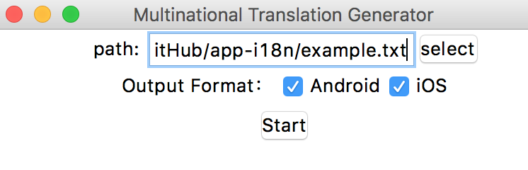
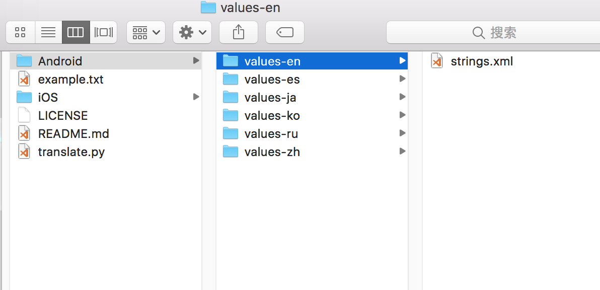
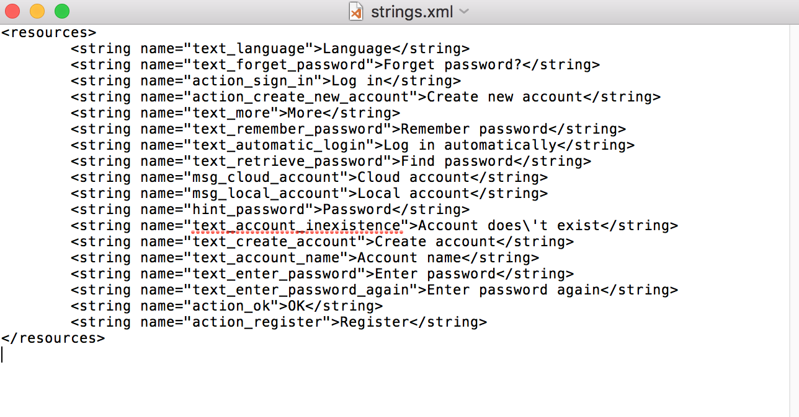
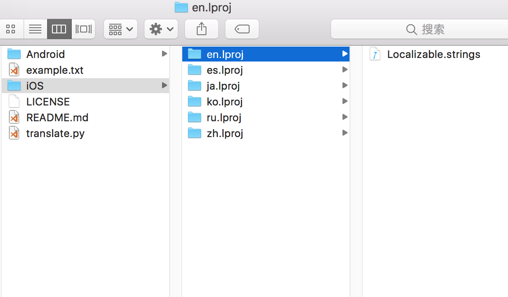
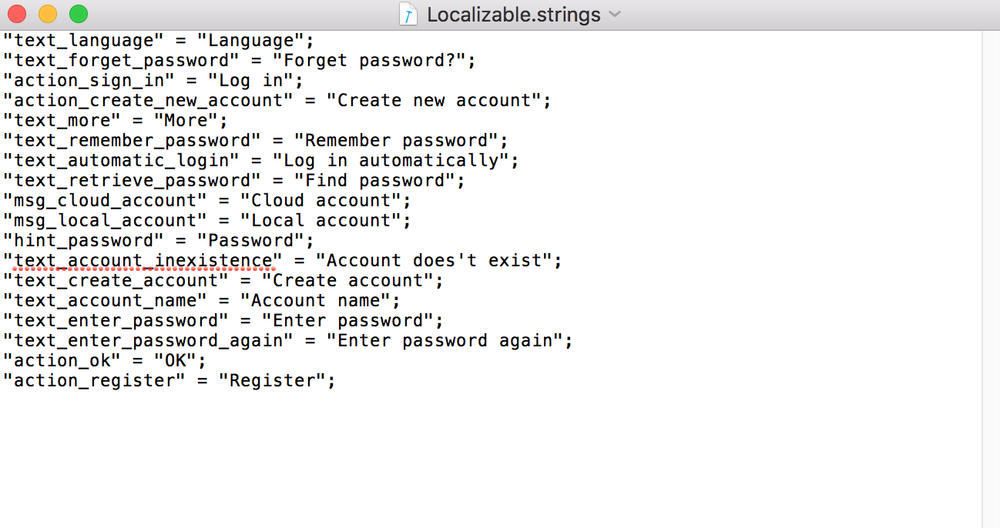
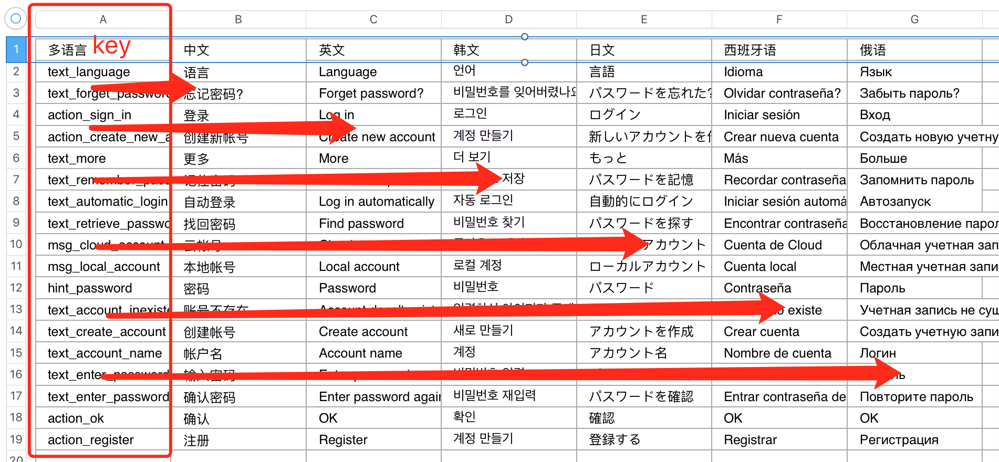
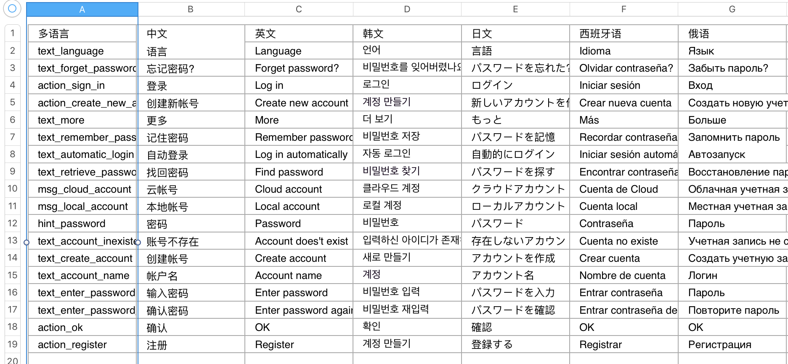

# app-i18n

app的国际化处理脚本，可以将翻译文档一键转换成Android以及iOS的格式

### GUI界面

### Android格式

### iOS格式

## Tips

文本第一行为翻译语言的类型，脚本会根据类型自动生成翻译文本（跟第一列组成key-value形式的翻译文本）

文本第一列为翻译文本的索引值，即各国翻译中的key（各国翻译中均有该key，所以这一列不能为空），其他列为各国翻译文本的value值(切换语言的时候会自动换成该文本)

***暂不支持Excel文档，请将Excel中的数据另存为txt文档，或者复制到文本编辑器中生成txt文档(不要使用Windows自带的记事本)，才能使用该脚本一键生成翻译文档***

## TODO

* Excel文档支持
* ~~GUI界面~~
* ~~不使用第三方库生成xml文本~~
* ~~分类别生成各国翻译的文件夹~~
* ~~一键生成Android翻译文本~~
* ~~一键生成iOS翻译文本~~
